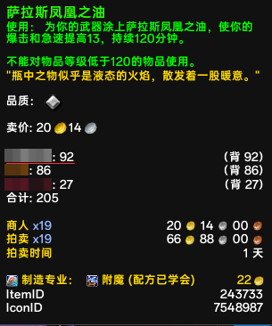
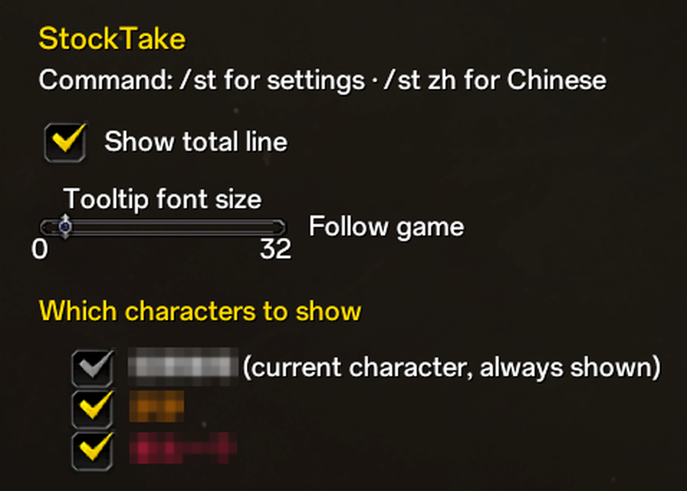

# 数量盘点 StockTake

> 写给还在为"这材料我小号身上还有多少"而切换角色翻包的老玩家。

## 功能

- 数量来自背包、银行（含战团银行）以及账号下所有角色。
- 每个角色一行，当前角色在第一行；最后一行是总计。
- 角色名按职业着色；括号里的明细对齐成一列。
- 拍卖行、聊天链接、银行里的物品都一样有效。
- 选项：显示/隐藏合计行、提示框字号（默认跟随游戏）、显示哪些角色。
- 命令：/st en、/st zh、/st tw、/st auto、/st clean [天数]。
- 每个角色在登录时记录背包，打开银行时记录银行。
- 5 个 Lua 文件，不依赖任何库。
## 为什么你会想要它

玩了这么多年，仓库早就不是"一个角色的仓库"了——是**一个账号的仓库**。合剂在德身上、矿石在法师包里、战团银行还压着一堆宝石。以前想知道"我到底有多少个这玩意儿"，要么切角色翻包，要么装个 BagSync 那种大家伙。

我这个插件只做一件事：**鼠标悬停在物品上，直接告诉你全账号谁有多少**。装上即用，没有配置向导，没有依赖库，一共 5 个文件。

## 它长这样

悬停任意物品（背包里、银行里、拍卖行里、聊天链接里都行），提示框会在游戏原生说明后面多出几行：

```
虚触强化符文
物品等级 350
使用：智力提高 25 点，持续 1 小时。
"可以在拍卖行购买和出售。"
                        ← 空一行，跟游戏内容隔开
老头一个:  27     （背 20 · 银 7）
                        ← 你自己那行下面有条红线，一眼找到
霜火之誓:  12     （背 12）
铁炉守卫:   3     （背 3）
合计: 42
                        ← 再空一行，其他插件的内容排在下面
卖价: 264 96 20
```



几个顺手的细节，都是实战里磨出来的：

- **你的当前角色永远在第一行**，名字下面一条红线，扫一眼就知道哪个是自己；
- **括号全部对齐成一条竖线**——数量位数差再多（3 / 12 / 170）也不会歪，这是按像素排的列，不是补空格糊弄；
- **"银"已经包含战团银行**。账号银行里的存货不会漏，也不会跟角色银行重复计数——你不用再心算"战团里还有几个"；
- 角色名按**职业颜色**显示，跟团队框架一个习惯；
- 位置排在**游戏原生说明之后、其他插件（Auctionator 的卖价之类）之前**——不用把长提示框拉到底才找到数量。

## 设置（就三样，多一样都嫌烦）

**ESC → 选项 → 插件 → 数量盘点**，或者直接 `/st`：

| 设置 | 说明 |
|---|---|
| 显示合计行 | 那行"合计: 42"，不要可以关 |
| 提示框字体大小 | **整个提示框**的字号（包括游戏自带的文字）。默认"跟随游戏"＝装上什么都不改 |

下面还有一栏**"显示哪些角色"**，它就是控制"其他角色"的唯一开关：练废的小号、已经删掉的角色还留着记录？把勾去掉，提示框立刻清爽；**全部取消勾选＝只看你自己**。当前角色永远显示，去不掉（那是你的主线数据）。



## 老玩家关心的问题

**为什么有的角色不显示数量？**
每个角色得**登录过一次**才会被记录（背包在登录时记，银行在打开银行时记）。新练的小号先上一下线就有了。

**战团银行怎么算的？**
并进当前角色的"银"里，走的是暴雪官方的 `includeAccountBank` 参数，实时准确。其他角色各自只算自己的角色银行，所以合计不会重复。

**身上的装备算在哪？**
不算在"背"里（"背"只数背包），单独显示为"装备"。所以只戴着一件、没有备件时，你看到的是
`名字: 1     （背 0 · 装备 1）`——它明确告诉你：包里没有多余的。
装备实时计入的只有**当前角色**这一行；其他角色只记录背包与银行快照，他们身上的装备
不计入所在行，也不计入合计。

**数据存在哪？怎么清空？**
`WTF\Account\账号\SavedVariables\StockTake.lua`，只存物品 ID 和数字，不存名字图标。想彻底重来，退游戏删掉这个文件即可。

**会不会跟我的 UI 套件打架？**
默认只往提示框**加自己的行**，不改缩放、不动别人的行。唯一例外是字号滑条——它是全局的（你要求的），如果你用了会改提示框字体的皮肤插件，两边可能互相覆盖；滑条留在"跟随游戏"就相安无事。

**内存占用大吗？怎么瘦身？**
运行时占用很小：悬停结果的缓存有硬上限（最多 128 条，满了自动淘汰最旧的），挂一晚上也不会慢慢变大。真正会随角色数量累积的，是各角色记下的背包/银行清单——`/st clean` 一键清掉久未登录的角色（默认 30 天，`/st clean 60` 就是 60 天）。注意清掉的只是"多久没上线的角色"的记录；想彻底重来，还是退游戏删 SavedVariables 文件（见上面那条）。

**想看看其他语言长什么样？**
内置三种语言：`/st zh` 中文、`/st tw` 繁体中文、`/st en` 英文，**全部即时切换（不用重载）**；`/st auto` 恢复跟随客户端。繁体客户端会自动使用繁体。

## 安装

把 `StockTake` 文件夹丢进 `World of Warcraft\_retail_\Interface\AddOns\`，重启客户端或 `/reload`。没有别的了。
（插件列表里显示的名字是**数量盘点**；文件夹名只是内部标识，不影响使用。）

## 我的其他插件

- [CraftPro](https://www.curseforge.com/wow/addons/craftpro) —— 打开配方点一下按钮，就得到一张材料清单：要什么、有多少、还缺多少。
- [AutoSpellQueue](https://www.curseforge.com/wow/addons/autospellqueue) —— 按专精自动调整施法容限，叠上你的延迟；不是固定数字，也不用你手动调。
